# Melanoma Detection with Knowledge Distillation

[](https://www.python.org/downloads/)
[](https://pytorch.org/)
[](https://github.com/astral-sh/ruff)
[](LICENSE)

This project implements knowledge distillation for melanoma detection on the HAM10000 dataset, targeting deployment on mobile phones and edge devices.

[project presentation](https://gemini.google.com/share/9df265ef7437)

## Table of Contents

- [Melanoma Detection with Knowledge Distillation](#melanoma-detection-with-knowledge-distillation)
  - [Table of Contents](#table-of-contents)
  - [Installation](#installation)
  - [Dataset Setup](#dataset-setup)
  - [Reproducing Results](#reproducing-results)
    - [Step 1: Train Teacher Model](#step-1-train-teacher-model)
    - [Step 2: Train Student with Knowledge Distillation](#step-2-train-student-with-knowledge-distillation)
    - [Step 3: Quantize Student Model](#step-3-quantize-student-model)
  - [Configuration](#configuration)
  - [Results](#results)
    - [Evaluation Metrics](#evaluation-metrics)
    - [Deployment Metrics](#deployment-metrics)
    - [Knowledge Distillation Ablation Study](#knowledge-distillation-ablation-study)
      - [KD Ablation Heatmaps](#kd-ablation-heatmaps)
      - [KD Configuration Comparison](#kd-configuration-comparison)
    - [Teacher vs Student Error Analysis](#teacher-vs-student-error-analysis)
      - [Complete Model Comparison](#complete-model-comparison)
      - [Teacher Model Comparison](#teacher-model-comparison)
      - [Knowledge Distillation Effectiveness](#knowledge-distillation-effectiveness)
      - [Latency Benchmarks](#latency-benchmarks)
      - [Holdout Set Evaluation](#holdout-set-evaluation)
      - [Teacher Threshold Curves](#teacher-threshold-curves)
      - [Student Threshold Curves](#student-threshold-curves)
      - [Training Curves (Student T=1, α=0.5)](#training-curves-student-t1-α05)
      - [ROC \& PR Curves](#roc--pr-curves)
      - [Reliability Diagram (Calibration)](#reliability-diagram-calibration)
      - [Teacher vs Student Comparison](#teacher-vs-student-comparison)
      - [Teacher vs Student Predictions](#teacher-vs-student-predictions)
      - [Confidence Distribution](#confidence-distribution)
      - [Challenging Cases](#challenging-cases)
      - [High Confidence Errors](#high-confidence-errors)
    - [Sklearn Baselines](#sklearn-baselines)
  - [Important Links](#important-links)
  - [Contact](#contact)
  - [Fixing Git](#fixing-git)
  - [Development Commands](#development-commands)
  - [Changelog](#changelog)

## Installation

```bash
# Clone repository
git clone <repo-url>
cd Deep_Learning_Final_Project

# Create virtual environment (using uv or pip)
uv venv && source .venv/bin/activate

# Install dependencies
make install
# or: pip install -e .

# Verify installation
python -c "from src import set_seed; print('OK')"
```

## Dataset Setup

1. Download HAM10000 from [Kaggle](https://www.kaggle.com/datasets/kmader/skin-cancer-mnist-ham10000) or ISIC Archive
2. Extract to `data/raw/ham_1000_archive/`
3. Run data preprocessing:

```bash
# make recommended
make data
```

Expected output:

- `data/processed/labeled_ham10000.csv` - Full labeled dataset
- `data/processed/train_data.csv` - Training set (~7,012 images)
- `data/processed/val_data.csv` - Validation set (~1,502 images)
- `data/processed/holdout_data.csv` - Holdout/test set (~1,503 images)
- `data/processed/split_metadata.json` - Split statistics and seed

## Reproducing Results

### Step 1: Train Teacher Model

**Teacher Architecture Comparison:**

Train all teacher architectures at once (skips any that already have checkpoints):

```bash
# Train ALL teachers (ResNet + EfficientNet)
make train-teacher

# Or train specific families:
make train-resnet-teachers       # ResNet-18/34/50/101/152
make train-efficientnet-teachers # EfficientNet-B0 through B7

# Or train a single architecture:
make train-teacher-single TEACHER_ARCH=resnet50
```

Or use `make summary` to see which experiments are complete and get commands for missing ones.

<details><summary>specific train script</summary>

```bash
python scripts/train_teacher.py \
    #--architecture resnet34 \
    --epochs 50 \
    --batch-size 32 \
    --lr 1e-4 \
    --loss focal \
    --patience 10 \
    --seed 42
```

</details>

### Step 2: Train Student with Knowledge Distillation

- make sure to run the ablation study first to choose the right hyper parameters for the student

our ablations were roughly:

- T=1, α=0.5
- T=2, α=0.9
- T=1, α=0.9

see results for more

<details><summary>expand for script</summary>
```bash
python scripts/train_student.py \
    #--teacher-ckpt models/checkpoints/teacher_resnet34_focal_best.pth \
    #--teacher-arch resnet34 \
    --student-arch mobilenet_v3_small \
    --temperature 2 \
    --alpha 0.5 \
    --epochs 50 \
    --seed 42
```

</details>

### Step 3: Quantize Student Model

```bash
python scripts/quantize_model.py \
    --model-ckpt models/checkpoints/student_T2_alpha0.5_best.pth \
    --method dynamic
```

## Configuration

All hyperparameters are centralized in `src/config.py`:

```python
from src.config import (
    DataConfig,      # batch_size, image_size, augmentation
    TeacherConfig,   # architecture, dropout, pretrained
    StudentConfig,   # architecture, size constraints
    TrainingConfig,  # epochs, lr, loss_type, early_stopping
    KDConfig,        # temperature, alpha (KD weight)
)
```

## Results

### Evaluation Metrics

| Metric | Description |
|--------|-------------|
| **ROC-AUC** | Area under the Receiver Operating Characteristic curve. Measures the model's ability to distinguish between melanoma and benign lesions across all classification thresholds. Higher is better (1.0 = perfect). |
| **PR-AUC** | Area under the Precision-Recall curve. More informative than ROC-AUC for imbalanced datasets like ours (11.4% melanoma). Focuses on the minority class (melanoma) performance. Higher is better. |
| **ECE** | Expected Calibration Error. Measures how well predicted probabilities match actual outcomes. An ECE of 0.10 means predictions are off by ~10% on average. Lower is better (0 = perfectly calibrated). |
| **F1 Score** | Harmonic mean of precision and recall. Balances false positives and false negatives. |

### Deployment Metrics

| Model | Size (MB) | Latency (ms) | ROC-AUC | ECE |
|-------|-----------|--------------|---------|-----|
| ResNet-18 | 42.7 | 1.9 | 0.900 | 0.195 |
| ResNet-34 | 81.3 | 3.4 | 0.898 | 0.205 |
| ResNet-50 | 89.9 | 4.9 | 0.866 | 0.559 |
| ResNet-101 | 162.5 | 9.0 | 0.886 | 0.221 |
| ResNet-152 | 222.4 | 14.4 | 0.900 | 0.219 |
| EfficientNet-B0 | 15.5 | 6.0 | 0.904 | 0.157 |
| EfficientNet-B1 | 25.1 | 8.6 | **0.919** | 0.174 |
| EfficientNet-B2 | 29.6 | 8.9 | 0.904 | **0.064** |
| EfficientNet-B3 | 41.1 | 9.7 | 0.908 | 0.076 |
| EfficientNet-B4 | 67.4 | 11.9 | 0.906 | 0.115 |
| EfficientNet-B5 | 108.8 | 14.8 | 0.899 | 0.235 |
| EfficientNet-B6 | 156.3 | 17.2 | 0.890 | 0.145 |
| EfficientNet-B7 | 244.5 | 20.4 | 0.917 | 0.169 |
| Student (T=1, α=0.5) | ~9.1 | ~3 | **0.921** | 0.072 |
| Student (T=2, α=0.5) | ~9.1 | ~3 | 0.920 | 0.134 |

### Knowledge Distillation Ablation Study

We conducted an ablation study to understand the impact of temperature (T) and alpha (α) on student model performance. Temperature controls the "softness" of teacher predictions, while alpha balances the weight between hard labels and soft teacher knowledge.

| Configuration | ROC-AUC | PR-AUC | F1 Score | Recall | Precision | Accuracy | ECE |
|--------------|---------|--------|----------|--------|-----------|----------|-----|
| **T=1.0, α=0.5** | **0.9214** | **0.6634** | **0.6418** | 0.750 | **0.561** | **0.905** | 0.072 |
| T=1.0, α=0.9 | 0.9158 | 0.6226 | 0.6071 | 0.692 | 0.541 | 0.898 | **0.064** |
| T=2.0, α=0.5 | 0.9200 | 0.6451 | 0.5605 | **0.849** | 0.418 | 0.849 | 0.134 |
| T=2.0, α=0.9 | 0.9187 | 0.6097 | 0.5556 | 0.843 | 0.414 | 0.847 | 0.130 |

**Key Findings:**

- **Best Overall: T=1.0, α=0.5** — Achieves highest ROC-AUC (0.9214), F1 (0.6418), and best precision-recall balance
- **Temperature Effect**: T=2.0 increases recall (catches more melanomas) but significantly reduces precision (more false positives)
- **Alpha Effect**: α=0.5 (balanced hard/soft labels) outperforms α=0.9 (mostly soft labels) on discriminative metrics
- **Best Calibration: T=1.0, α=0.9** — Lowest ECE (0.064) but trades off discriminative performance

<details>
<summary><b>🔬 Ablation Visualizations (click to expand)</b></summary>

#### KD Ablation Heatmaps

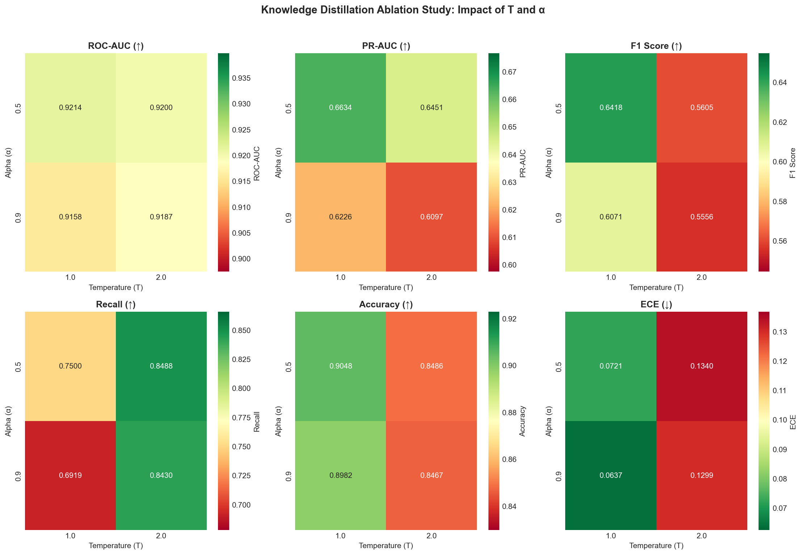

#### KD Configuration Comparison

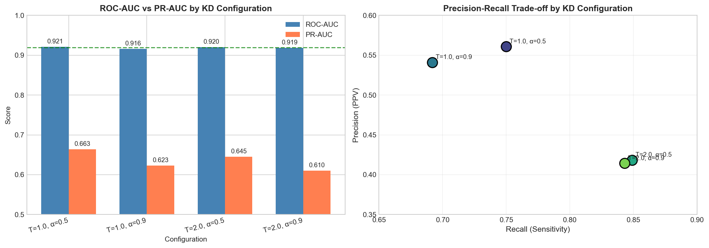

</details>

### Teacher vs Student Error Analysis

On the holdout set (1,513 images, 11.4% melanoma prevalence):

| Metric | Value |
|--------|-------|
| Total samples | 1,513 |
| Models agree | 1,331 (88.0%) |
| Models disagree | 182 (12.0%) |
| Teacher correct | 1,307 (86.4%) |
| Student correct | 1,369 (90.5%) |
| Both correct | 1,247 (82.4%) |
| **Both wrong** | **84 (5.6%)** |

**Disagreement Analysis:**

When models disagree, the **Student is right 67% of the time** (122 vs 60 cases).

| Error Type | Count | Description |
|------------|-------|-------------|
| Both miss melanoma (FN) | 29 | ⚠️ Dangerous cases — melanomas both models fail to detect |
| Both false alarm (FP) | 55 | Benign lesions incorrectly flagged by both |

The 29 shared false negatives (~17% of melanomas) represent **hard-to-classify cases** with atypical visual features that neither model can detect. These edge cases may require additional data augmentation, ensemble approaches, or human expert review.

<details>
<summary><b>📊 Model Comparison Charts (click to expand)</b></summary>

#### Complete Model Comparison

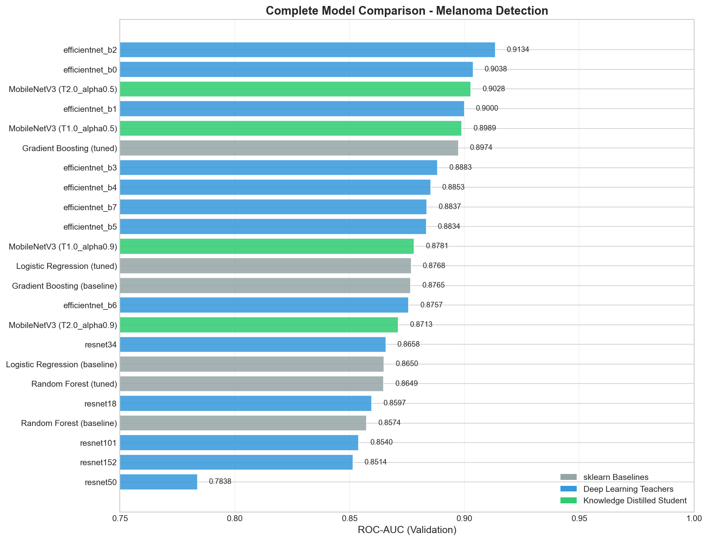

#### Teacher Model Comparison

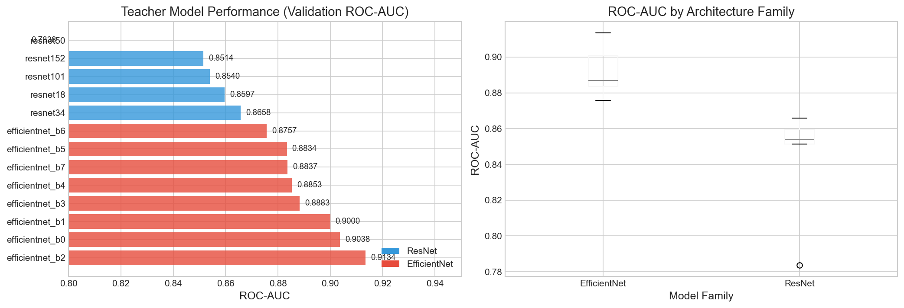

#### Knowledge Distillation Effectiveness

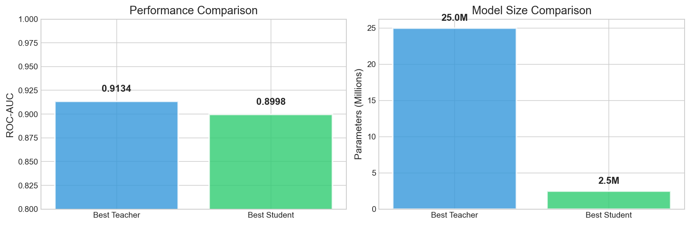

#### Latency Benchmarks

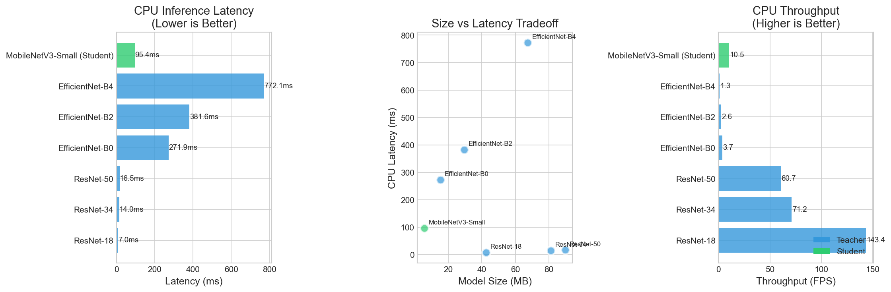

</details>

<details>
<summary><b>📈 ROC & PR Curves (click to expand)</b></summary>

#### Holdout Set Evaluation

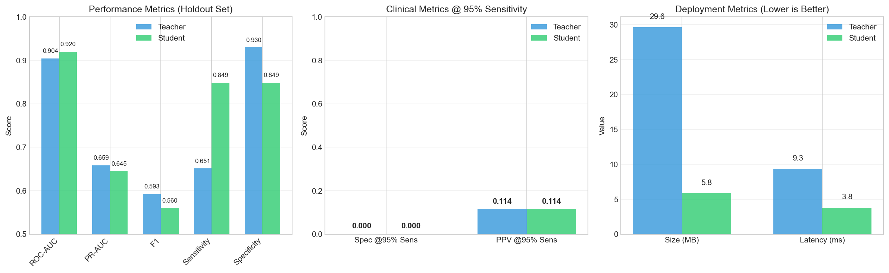

#### Teacher Threshold Curves

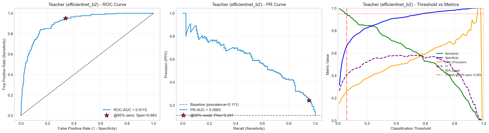

#### Student Threshold Curves

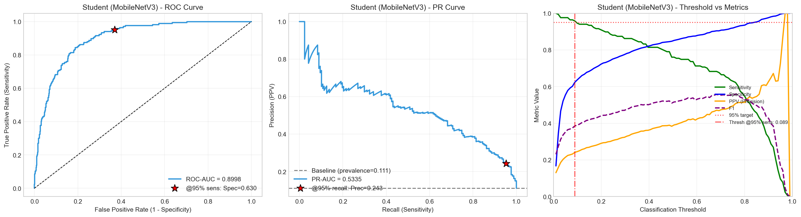

</details>

<details>
<summary><b>🎯 Best Student Model Training (click to expand)</b></summary>

#### Training Curves (Student T=1, α=0.5)

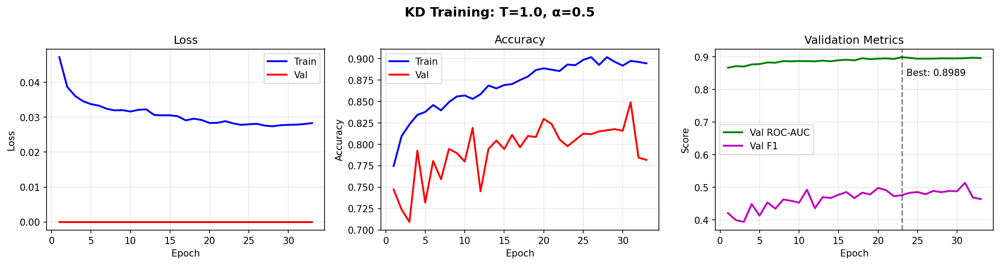

#### ROC & PR Curves

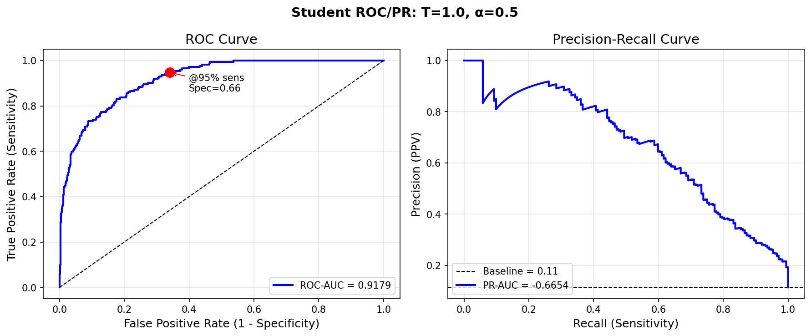

#### Reliability Diagram (Calibration)

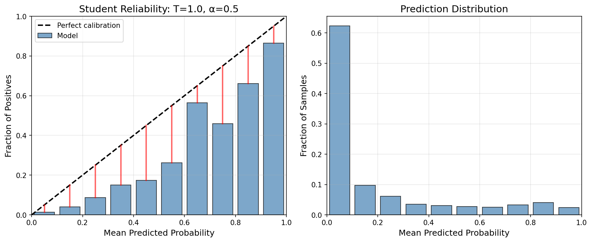

#### Teacher vs Student Comparison

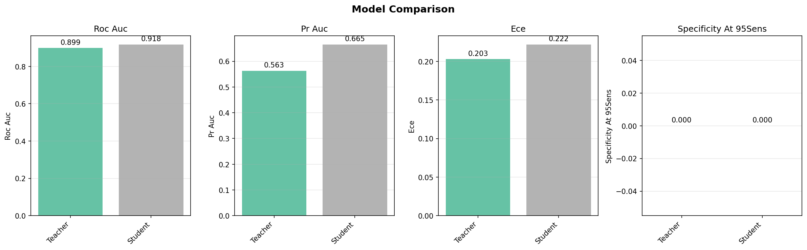

</details>

<details>
<summary><b>🔬 Inference Analysis (click to expand)</b></summary>

#### Teacher vs Student Predictions


#### Confidence Distribution

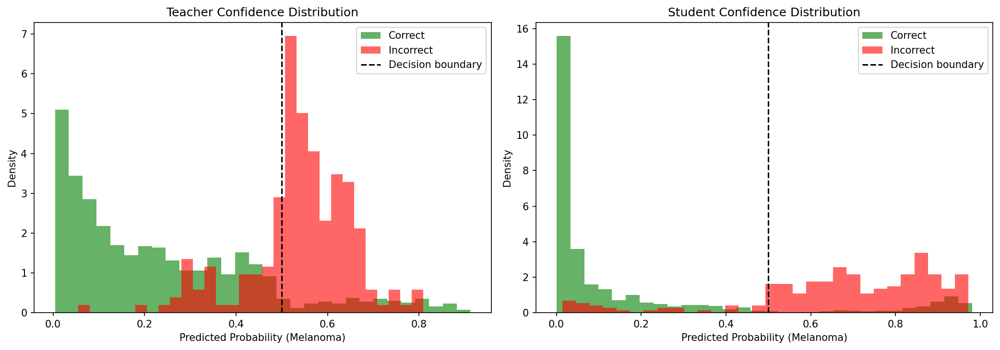

#### Challenging Cases


#### High Confidence Errors

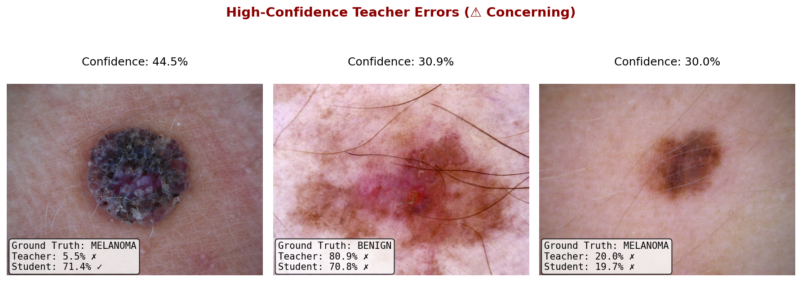

</details>

### Sklearn Baselines

Traditional ML baselines for comparison (using hand-crafted features):

| Model | Features | ROC-AUC | PR-AUC |
|-------|----------|---------|--------|
| Random Forest | Combined | 0.853 | 0.392 |
| Gradient Boosting | Combined | 0.845 | 0.366 |
| SVM (RBF) | Combined | 0.824 | 0.336 |
| Logistic Regression | Combined | 0.797 | 0.289 |

Run baselines with:

```bash
make sklearn-baselines        # Full benchmark (all models, combined features)
make sklearn-baselines-quick  # Quick test (logistic regression, 1000 samples)
```

## Important Links

- [Overleaf working document](https://www.overleaf.com/read/ycgbrjvyyqbx#5162eb)
- [TA Rivanna Guide](https://github.com/JustUnoptimized/ds6050-rivanna)

## Contact

Ryan Healy (rah5ff) and Angie Yoon

---

## Fixing Git

Downloading this many models and datasets, it is really easy to accidentally add something to to the commit history that isn't supposed to be there.

1) list large files

```bash
# check size total repo
du -h .git

# check large files 
git rev-list --objects --all \
  | git cat-file --batch-check='%(objecttype) %(objectname) %(objectsize) %(rest)' \
  | awk '$1=="blob" {size=$3; sha=$2; $1=$2=$3=""; path=substr($0,4); printf "%.2fMB\t%s\t%s\n", size/1024/1024, sha, path}' \
  | sort -nr \
  | head -n 50

# filter the repo
# install if needed brew install filter-repo
git filter-repo --strip-blobs-bigger-than 5M


# Cleanup and force-push (coordinate with collaborators)
git reflog expire --expire=now --all
git gc --prune=now --aggressive
git push --force origin --all
git push --force origin --tags


```

## Development Commands

```bash
make install       # Install dependencies
make test          # Run tests with coverage
make lint          # Run linters (ruff, mypy)
make format        # Format code (black, isort)
make clean         # Clean build artifacts
make check-all     # Run format, lint, and test
make summary       # Generate experiment status report
```

## Changelog

- **Lesion-aware data splitting**: Prevents data leakage by ensuring images from the same lesion don't appear in different splits
- **Teacher models**: Multiple architectures supported for ablation:
  - **ResNet family**: ResNet-18, 34, 50, 101, 152
  - **EfficientNet family**: EfficientNet-B0 through B7
  - All pretrained on ImageNet, fine-tuned with focal loss for class imbalance
- **Student model**: MobileNetV3-Small for mobile deployment (<25 MB)
- **Knowledge distillation**: Temperature-scaled KD with focused hyperparameter search (T ∈ {1, 2}, α ∈ {0.5, 0.9})
- **Comprehensive evaluation**: ROC-AUC, PR-AUC, sensitivity/specificity at 95% recall, ECE calibration
- **INT8 quantization**: Post-training quantization for edge deployment
- **Sklearn baselines**: Traditional ML benchmarks (Logistic Regression, Random Forest, GBM, SVM)
- **Experiment tracking**: W&B integration for logging, `make summary` for experiment status
